# Captures d'écrans du fonctionnement des scripts

## 1. Deauthentication de clients 802.11

Lancement du script :

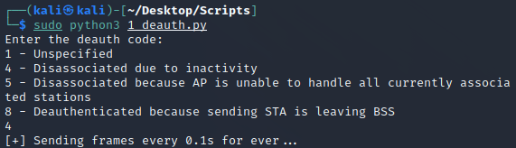

Le réseau se déconnecte :

On nous demande automatiquement de remettre le mot de passe du réseau :

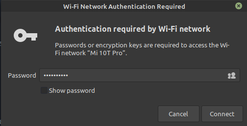

## 2. Fake channel

Lancement du script :

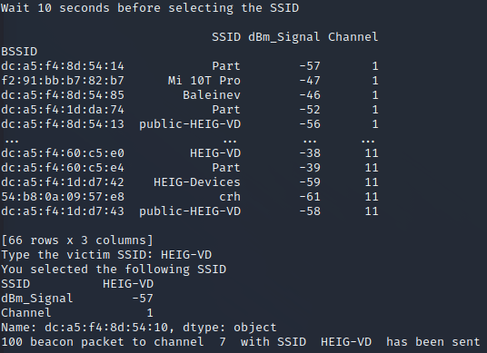

On observe effectivement 2 SSID "HEIG-VD" :

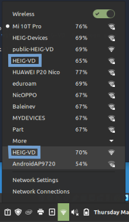

## 3. SSID flood

Lancement du script :

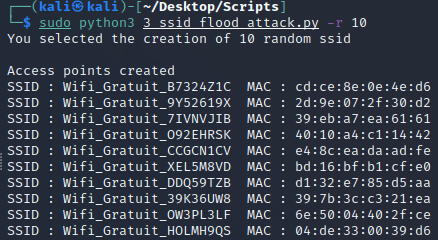

On retrouve tous ces réseaux créés dans la liste des Wi-Fi disponibles :

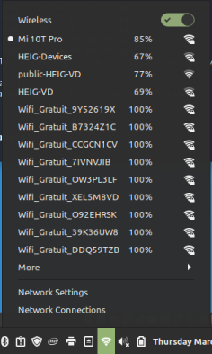

## 4. Evil twin

Lancement du script :

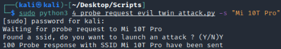

On observe effectivement 2 SSID "Mi 10T Pro" :

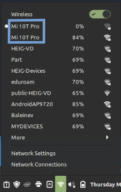

## 5. Detection STA and AP

Script a :

Lancement du script :

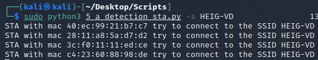

Script b :

Lancement du script :

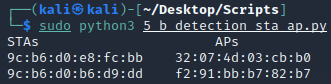

La deuxième ligne correspond à une connexion connue puisqu'il s'agit de la connexion entre la machine hôte et l'AP :

Adresse MAC de l'AP :

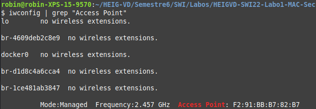

Adresse MAC de la machine hôte :

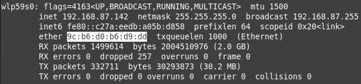

## 6. Hidden SSID reveal

Lancement du script :

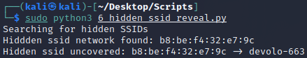